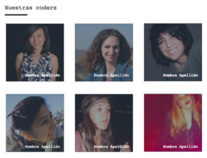

# **Proyecto Nuestras Coders** | 

***

## **Objetivo**

* Con los conocimientos adquiridos en HTML y CSS, replicar el siguiente esquema:

## **Consideraciones específicas**

* Debes subir tu ejercicio a GitHub y publicarlo en gh-pages.
